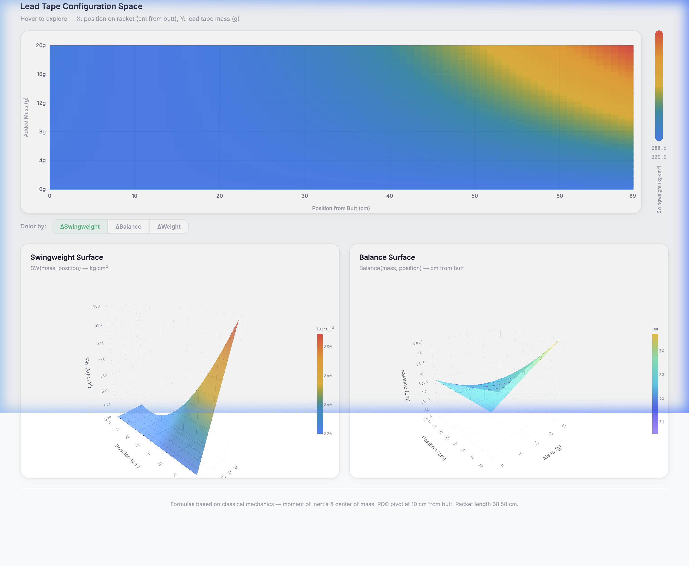
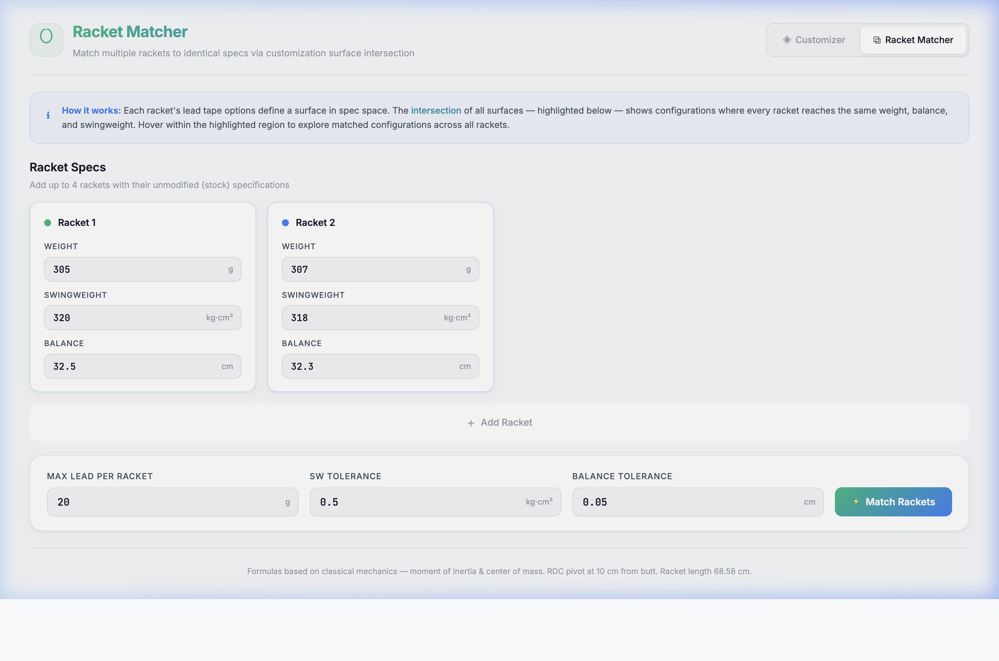

# 🎾 Tennis Racket Customization Visualizer

An interactive web tool for visualizing how lead tape placement affects a tennis racket's **swingweight**, **balance**, and **static weight**. Explore the full customization space through 2D heatmaps and 3D surface plots, and match multiple rackets to identical specs.

<p align="center">
  
</p>

## Features

### Customizer

- **2D Configuration Heatmap** — Color-coded grid mapping every combination of lead tape mass (g) and position (cm from butt) to the resulting change in swingweight, balance, or weight.
- **3D Surface Plots** — Interactive Plotly surfaces for swingweight and balance, rendered as functions of mass and position.
- **Live Hover Readout** — Hover anywhere on the heatmap to see the exact resulting specs in a fixed readout bar, with synchronized crosshairs on both the 2D grid and 3D plots.
- **Configurable Base Specs** — Enter your racket's stock weight, swingweight, balance, and max lead mass, then hit **Visualize**.

### Racket Matcher

<p align="center">
  
</p>

- **Multi-Racket Matching** — Add up to 4 rackets with different stock specs and find configurations where **all rackets reach the same weight, balance, and swingweight**.
- **Surface Intersection** — The tool computes the intersection of each racket's customization surface, highlighting the matched region on per-racket heatmaps.
- **Click-to-Pin** — Click any matched cell to pin the configuration; hover to preview alternatives.
- **Customization Curves** — A 2D line plot shows each racket's achievable (Balance, SW) pairs at the selected target weight, with the match point marked as a star.
- **Combined 3D Surfaces** — All racket surfaces overlaid with matched regions shown as gold markers.

## Physics

The tool uses classical mechanics formulas to compute how adding a point mass changes the racket's specifications:

| Spec | Formula |
|------|---------|
| **Static Weight** | `W_new = W_original + m` |
| **Balance** | `B_new = (W_original × B_original + m × d) / (W_original + m)` |
| **Swingweight** | `SW_new = SW_original + (m / 1000) × (d − 10)²` |

Where:
- **m** = added mass in grams
- **d** = position from butt in cm
- **10 cm** = RDC standard pivot point
- **68.58 cm** = standard racket length (27 inches)

Swingweight is the moment of inertia about the RDC pivot axis, and added mass contributes via the **parallel axis theorem**.

## Getting Started

### Prerequisites

A modern web browser with JavaScript enabled. No build tools, package managers, or server-side dependencies required.

### Running Locally

```bash
# Clone the repository
git clone https://github.com/r09g/tennis_racket_customizer.git
cd tennis_racket_customizer

# Serve with any static file server
python3 -m http.server 8080

# Open in browser
open http://localhost:8080
```

Or simply open `index.html` directly in your browser.

### Usage

1. **Customizer** — Enter your racket's base specs (weight, swingweight, balance) and click **Visualize**. Hover over the 2D heatmap to explore the configuration space.
2. **Racket Matcher** — Navigate to the Matcher tab, add 2–4 rackets with their stock specs, set tolerances, and click **Match Rackets** to find configurations where all frames reach identical specs.

## Tech Stack

- **HTML / CSS / JavaScript** — Zero-dependency frontend, no frameworks
- **[Plotly.js](https://plotly.com/javascript/)** — 3D surface plots and 2D line charts
- **[Inter](https://rsms.me/inter/) + [JetBrains Mono](https://www.jetbrains.com/lp/mono/)** — Typography via Google Fonts
- **Canvas API** — Hardware-accelerated 2D heatmap rendering

## Project Structure

```
tennis_racket_customizer/
├── index.html          # Customizer page
├── match.html          # Racket Matcher page
├── app.js              # Customizer logic (physics, data gen, grid, 3D plots)
├── match.js            # Matcher logic (surface intersection, multi-racket matching)
├── style.css           # Shared styles for both pages
├── docs/
│   └── screenshots/    # Screenshots for documentation
├── README.md
└── LICENSE.md
```

## License

This project is licensed under the MIT License — see [LICENSE.md](LICENSE.md) for details.
